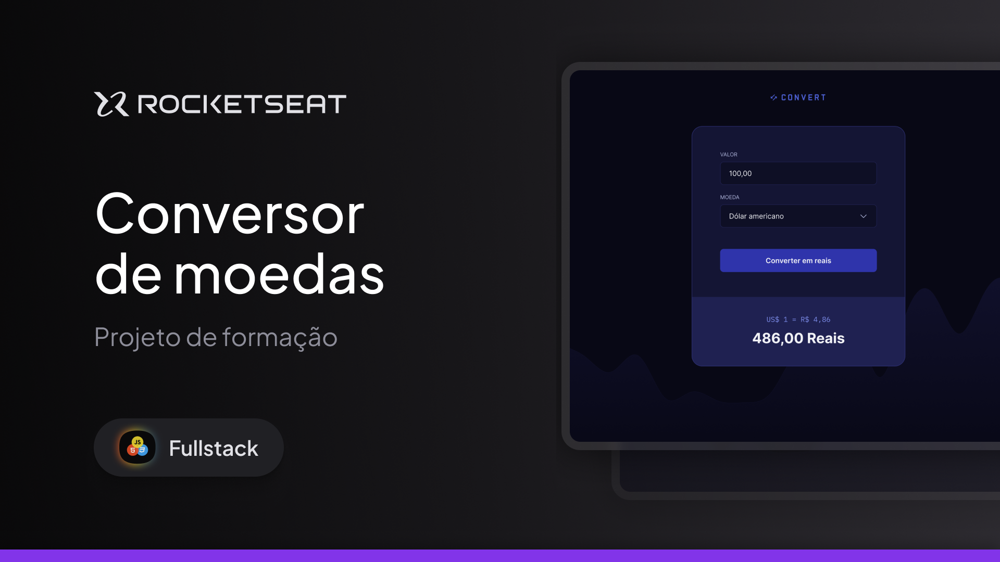

  

  <a href="#-projeto">Projeto</a>&nbsp;&nbsp;&nbsp;|&nbsp;&nbsp;&nbsp;
  <a href="#-tecnologias">Tecnologias</a>&nbsp;&nbsp;&nbsp;|&nbsp;&nbsp;&nbsp;
  <a href="#memo-licença">Licença</a>

  

 

  

## 👩🏻‍💻 Projeto

Convert é uma aplicação web de conversão de moedas para real.
Esse é um dos projetos desenvolvidos em aula na formação de Javascript.

## 🚀 Tecnologias

Esse projeto foi desenvolvido com as seguintes tecnologias:

- Javascript
- HTML
- CSS

## 

 Feito com 💜 by Palloma Gualter :wave:

